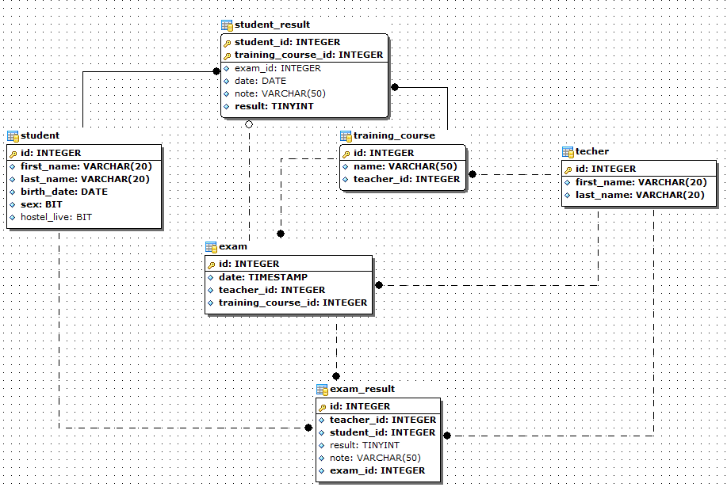

## Схема базы данных

## Задание
1. Выбрать имена и фамилии студентов, успешно сдавших экзамен, упорядоченных по результату экзамена (отличники первые в результате)
2. Посчитать количество студентов, успешно сдавших экзамен на 4 и 5
3. Посчитать количество студентов, сдавших экзамен “автоматом” (нет записи в таблице exam_result но есть положительный результат в таблице student_result)
4. Посчитать средний балл студентов по предмету с наименованием “Системы управления базами данных”
5. Выбрать имена и фамилии студентов, не сдававших экхзамен по предмету “Теория графов” (2 вида запроса)
6. Выбрать идентификатор преподавателей, читающих лекции по больше чем по 2 предметам
7. Выбрать идентификатор и фамилии студентов, пересдававших хотя бы 1 предмет
8. Вывести имена и фамилии 5 студентов с максимальными оценками
9. Вывести фамилию преподавателя, у которого наилучшие результаты по его предметам
10. Вывести успеваемость студентов по годам по предмету “Математическая статистика”
## Ответы
1. SELECT first_nam, lASt_name  
   FROM student AS st  
   JOIN student_result AS st_res  
   ON st.id = st_res.student_id
   ORDER BY st_res.note DESC
   
2. SELECT COUNT(student_id)  
   FROM student_result  
   WHERE note > 3  
   GROUP BY student_id
       
3. SELECT COUNT(*)  
   FROM exam_result AS ex _res  
   RIGHT JOIN student_result AS st_res  
   ON ex_res.student_id = st_res.student_id  
   AND ex_res.exam_id = st_res.exam_id  
   GROUP BY ex_res.student_id
   
4. SELECT AVG(note)
   FROM student result AS st_res  
   JOIN training_course AS crs  
   ON sr_res.course_id = crs.id  
   WHERE crs.name = "Системы управления базами данных"
   
5. 1. SELECT st.first_name, st.second_name  
   FROM student AS st  
   JOIN exam_result AS ex_res  
   ON st.id = ex_res.student_id  
   WHERE ex_res.result = 0 // или другое условие проваленого экзамена  
   AND ex_res.exam_id IN (  
   SELECT ex.id  
   FROM exam AS ex  
   JOIN training_course AS crs  
   ON ex.training_course_id = crs.id  
   WHERE crs.name = "Теория графов" )
     
   2. SELECT st.first_name, st.second_name  
   FROM student AS st  
   JOIN student_result AS st_res  
   ON st.id = st_res.student_id  
   WHERE st_res.note = 0  
   AND st_res.training_course_id = (  
   SELECT id  
   FROM training_course  
   WHERE name = "Теория графов" )
   
6. SELECT teacher_id  
   FROM training_course  
   GROUP BY teacher_id  
   HAVING COUNT(*) > 3
   
7. SELECT st.id, st.second_name  
   FROM student AS st  
   JOIN exam_result AS ex_res  
   ON st.id = ex_res.student_id  
   GROUP BY st.id, ex_res.exam_id  
   HAVING COUNT(*) > 1
   
8. SELECT st.first_name, st.lASt_name  
   FROM student AS st  
   JOIN student_result AS st_res  
   ON st.id = st_res.student_id  
   ORDER BY st_res.note DESC  
   LIMIT 5 
   
9. SELECT t.lASt_name  
   FROM teacher AS t  
   JOIN exam_result AS ex_res  
   ON t.id = ex_res.teacher_id  
   GROUP BY t.id   
   ORDER BY AVG(ex_res.note)  
   LIMIT 1
   
10. SELECT YEAR(ex.data), AVG(ex_res.note)  
    FROM exam AS ex  
    JOIN exam_res AS ex_res  
    GROUP BY YEAR(ex.date)  
    ORDER BY YEAR(ex.date)